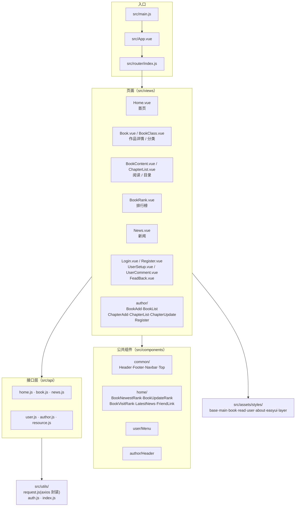

# novel-front-web

> **本项目是开源项目 [novel](https://github.com/201206030/novel) 的「前端」部分**，
> 原项目由 **201206030 / novel_dev_team** 开发并开源，遵循 **Apache License 2.0**。
> 本仓库为其前端工程的副本，用于学习与本地运行，**并非原创作品**；
> 代码与设计版权归原作者所有，详见 [归属与许可证](#归属与许可证)。

novel 是一套基于 **Spring Boot 3 + Vue 3** 的前后端分离**学习型**小说项目，
由小说门户系统、作家后台管理系统、平台后台管理系统等子系统构成，
包含小说推荐、作品检索、排行榜、阅读、评论、会员中心、作家专区、充值订阅、新闻发布等功能。

本仓库对应其中的 **小说门户前台（读者端）+ 作家专区** 前端。

---

## 技术栈

| 技术 | 版本 | 说明 |
|---|---|---|
| Vue.js | `^3.2.13` | 渐进式 JavaScript 框架 |
| Vue Router | `^4.0.15` | 官方路由 |
| axios | `^0.27.2` | 基于 Promise 的网络请求库 |
| element-plus | `^2.2.0` | Vue 3 组件库 |
| jQuery | `^3.6.0` | 通过 webpack `ProvidePlugin` 全局注入（`$` / `jQuery`） |
| core-js | `^3.8.3` | polyfill |
| 构建 | `@vue/cli-service` ~5.0.0 | Vue CLI 5 |
| 代码检查 | ESLint 7 + `eslint-plugin-vue` 8 | `plugin:vue/vue3-essential` |

`package.json` 中 `version` 为 **3.4.0**。

---

## 前端架构



---

## 目录结构

```
novel-front-web/
├── public/
│   ├── index.html
│   ├── favicon.ico
│   └── default.gif
├── src/
│   ├── main.js                    # 应用入口
│   ├── App.vue
│   ├── api/                       # 接口封装（按业务域拆分）
│   │   ├── home.js  book.js  news.js
│   │   └── user.js  author.js  resource.js
│   ├── router/index.js            # 路由表
│   ├── utils/
│   │   ├── request.js             # axios 实例封装
│   │   ├── auth.js                # 登录态处理
│   │   └── index.js
│   ├── components/
│   │   ├── common/                # Header / Footer / Navbar / Top
│   │   ├── home/                  # 首页榜单与新闻区块
│   │   ├── user/Menu.vue
│   │   └── author/Header.vue
│   ├── views/
│   │   ├── Home.vue  Book.vue  BookClass.vue  BookContent.vue
│   │   ├── BookRank.vue  ChapterList.vue  News.vue
│   │   ├── Login.vue  Register.vue  UserSetup.vue  UserComment.vue
│   │   ├── FeadBack.vue           # 注：文件名为原项目的拼写
│   │   └── author/                # 作家专区
│   │       ├── Register.vue  BookAdd.vue  BookList.vue
│   │       └── ChapterAdd.vue  ChapterList.vue  ChapterUpdate.vue
│   └── assets/
│       ├── images/                # 图标、头像、支付图标等
│       └── styles/                # base/main/book/read/user/about/easyui/layer
├── vue.config.js
├── babel.config.js
├── jsconfig.json
├── package.json
├── yarn.lock
└── LICENSE                        # Apache License 2.0
```

---

## 构建配置

`vue.config.js`：

| 配置 | 值 | 说明 |
|---|---|---|
| `devServer.port` | **1024** | 开发服务器端口 |
| `transpileDependencies` | `true` | 依赖转译 |
| `lintOnSave` | `false` | 保存时不强制 lint |
| `configureWebpack.plugins` | `webpack.ProvidePlugin` | 把 `$` / `jQuery` 全局注入，兼容依赖 jQuery 的老代码 |

> 注意：后端接口地址需按部署环境配置（见 `src/utils/request.js` 中的 axios `baseURL`）。

---

## 运行

**前置**：Node 16.14（原项目声明版本）、可用的 novel 后端服务。

```bash
git clone https://github.com/DLDLDL13579/novel-front-web.git
cd novel-front-web
yarn install          # 或 npm install
yarn serve            # 开发服务器，默认 http://localhost:1024
yarn build            # 生产构建
yarn lint             # 代码检查
```

> 前端依赖后端提供数据。后端见配套项目 `novel`（同一上游仓库）。

---

## 开发环境要求（上游项目声明）

| 项 | 版本 |
|---|---|
| Node | 16.14 |
| 后端 JDK | 21 |
| MySQL | 8.0 |
| Redis | 7.0 |

---

## 归属与许可证

### 上游项目

| 项 | 内容 |
|---|---|
| 项目 | **novel** —— 前后端分离学习型小说项目 |
| 作者 / 组织 | **201206030**（GitHub） / **novel_dev_team**（Gitee） |
| 后端仓库 | https://github.com/201206030/novel ｜ https://gitee.com/novel_dev_team/novel |
| 前端仓库 | https://github.com/201206030/novel-front-web ｜ https://gitee.com/novel_dev_team/novel-front-web |
| 线上应用版 | https://github.com/201206030/novel-plus |
| 微服务版 | https://github.com/201206030/novel-cloud |
| 配套教程 | https://docs.xxyopen.com/course/novel |
| **许可证** | **Apache License 2.0**（仓库内 `LICENSE` 文件） |

### 本仓库说明

- 本仓库是上述**上游前端项目**的副本，保留原始 `LICENSE`（Apache-2.0）与原作者署名，
  未主张任何原创权利。
- 依据 Apache-2.0，可自由使用、修改与再分发，但须保留版权声明与许可证文本，
  且不得使用原作者名义为衍生作品背书。
- 本项目为**学习用途**，上游作者亦将其定位为教学示例项目。
- `src/assets/images/` 中的图片素材（含第三方登录图标 `login_qq.png`、`login_weibo.png`、
  `login_weixin.png`，支付图标 `pay_wx.png`、`pay_zfb.png`）版权归对应平台 / 品牌方所有，
  此处仅为演示引用。
